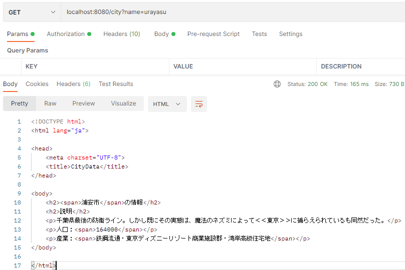
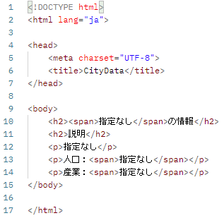
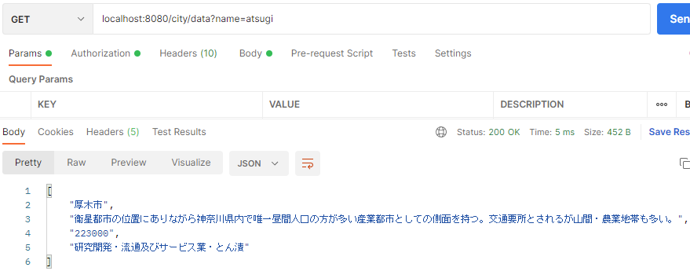
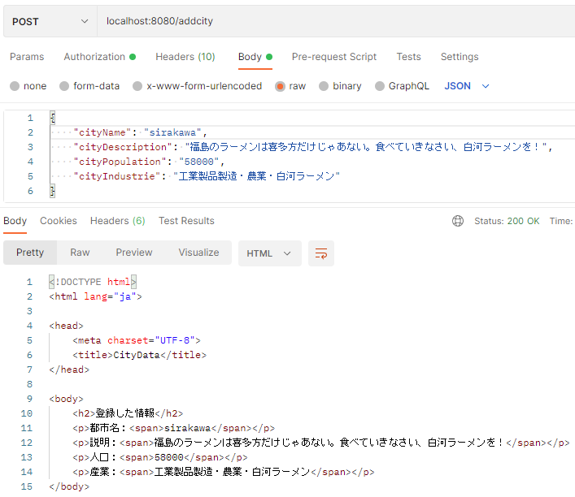
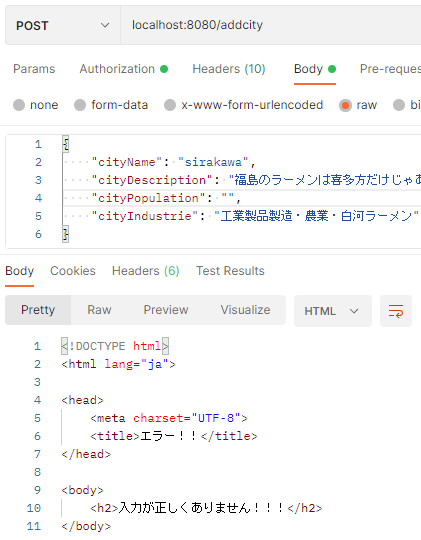
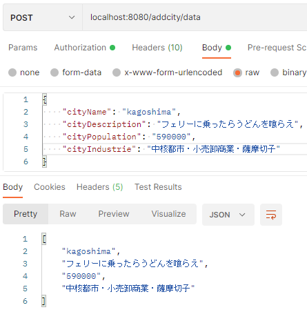
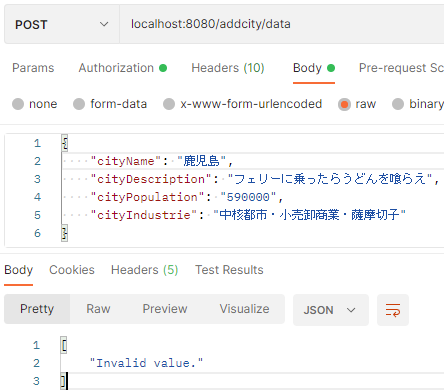

# 第7回 課題 REST API 表面実装

GET/ POST/ PATCH/ DELETE を仮実装する。  
それぞれ HTMLレスポンスをするための @Controller と、  
JSONレスポンスをするための @RestController を用意した。

`out.txt` は `CheckStyle` による出力ファイル。  
Javadocに関する警告と、行文字数の警告は一部無視した。

## アプリ想定

都市の情報を管理するアプリケーション。

- name: 都市名
- description: 都市の説明
- population: 都市の人口
- industrie: 主要産業

上記の4つのデータを持つアプリと想定した。  
各APIの機能は以下のように想定している。

### GET(HTML) [/city]

- アクセス先: `/city`
- パラメータ変数: `name`

パラメータにアルファベットで都市名を指定すると該当の都市情報をHTMLで取得できる。  
課題では「浦安市」「厚木市」の疑似データを入れている。  
urayasu, atsugi, 以外は「指定なし」となる。

例）`localhost:8080/city?name=urayasu` へアクセス

例）`localhost:8080/city?name=hoge` へアクセス

### GET(JSON) [/city/data]

- アクセス先: `/city/data`
- パラメータ変数: `name`

同様に浦安市か厚木市の情報をJSONで取得できる。

例）`localhost:8080/city/data?name=atsugi` へアクセス

### POST(HTML) [/addcity]

- アクセス先: `/addcity`
- リクエストボディ
  - cityName: バリデーションは[Null無効][アルファベットのみ]
  - cityDescription: 入力自由
  - cityPopulation: バリデーションは[数字1桁以上10桁まで]
  - cityIndustrie: 入力自由

都市情報を登録するためのAPIで、登録した情報を返す。  
バリデーション違反時は処理内で例外を捉える。  
例外を捉えた場合は共通のエラーページを表示する。

例）`localhost:8080/addcity` へアクセス（ボディ情報は画像の通り）

例）`localhost:8080/addcity` へ無効なデータでアクセス（人口の値を空白に）

### POST(JSON) [/addcity/data]

- アクセス先: `/addcity/data`
- リクエストボディは上記と同様

バリデーション違反時は `Invalid value.` というJSONを返す。

例）`localhost:8080/addcity/data` へアクセス（ボディ情報は画像の通り）

例）`localhost:8080/addcity/data` へ無効なデータでアクセス

### PATCH(HTML) [/editcity]

- アクセス先: `/editcity`
- リクエストボディは上記と同様

登録されている都市情報を変更するためのAPIで、変更した情報を返す。  
課題の上では POST(HTML) と同じような動きをするが、  
処理上は別々のメソッドを使用している。実行画像は省略。

### PATCH(JSON) [/editcity/data]

- アクセス先: `/editcity/data`
- リクエストボディは上記と同様

こちらも POST(JSON) と同等の動きをする。実行画像は省略。

### DELETE(HTML) [/erasecity]

- アクセス先: `/erasecity`
- パラメータ変数: `name`

GET(HTML) と同様の動きで、パラメータ変数に都市名を指定することで登録情報を削除する想定。  
「削除した情報」をHTMLとして表示する。課題の実装上は別のメソッドで、内容はGETと同じ。  
特にバリデーションや、登録チェックなどは実施していない。実行画像は省略。

### DELETE(JSON) [/erasecity/data]

- アクセス先: `/erasecity/data`
- パラメータ変数: `name`

GET(JSON)とほぼ同等の動き。上記と同様。実行画像は省略。
